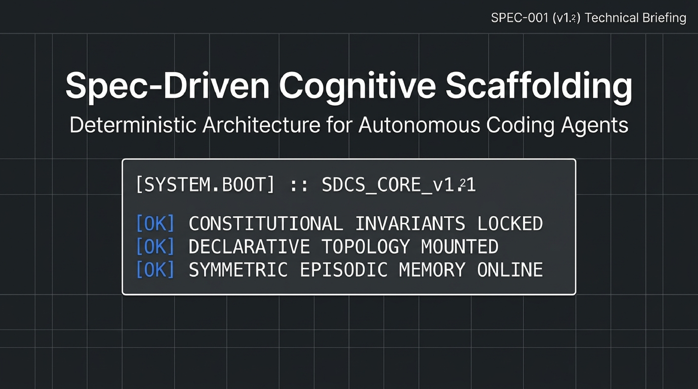
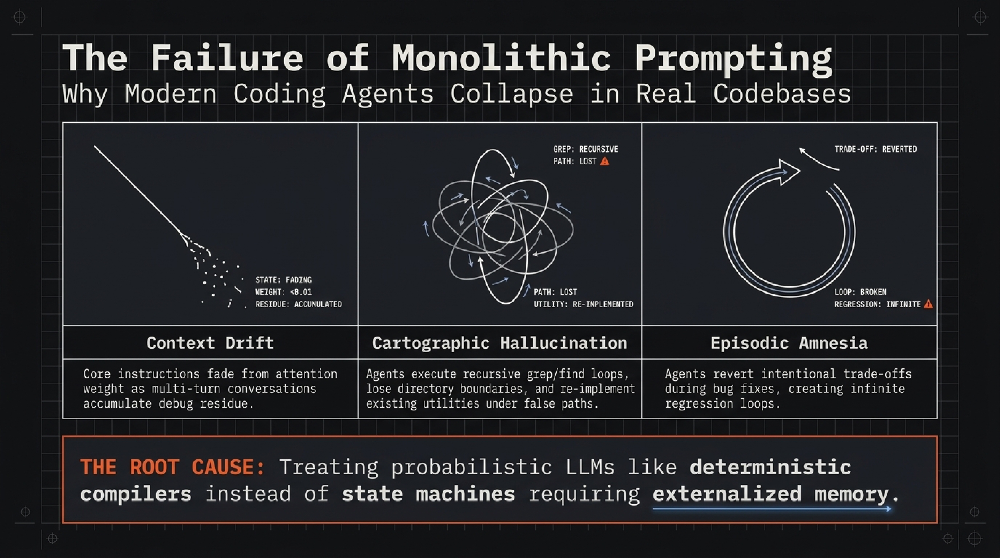
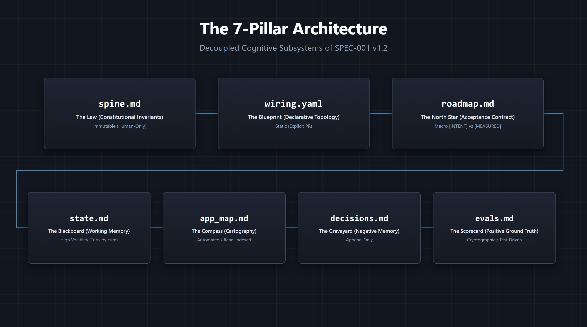
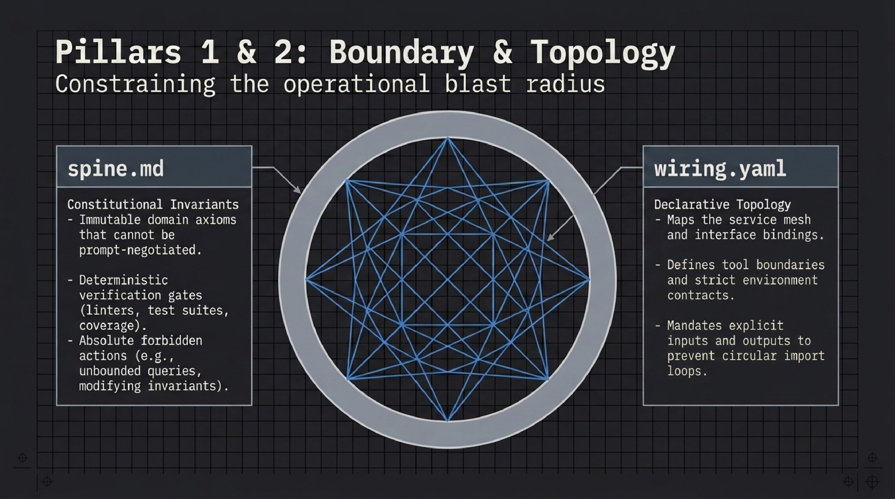
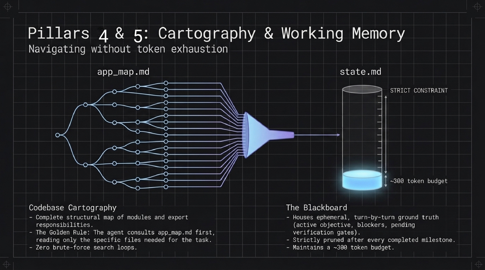
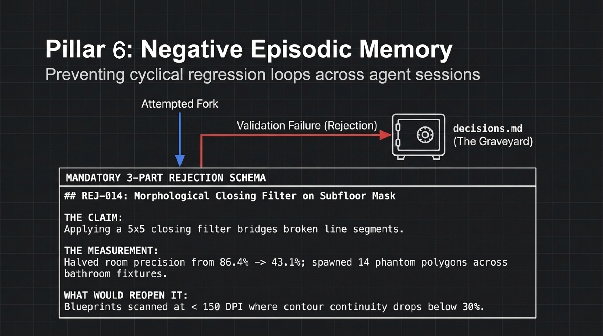
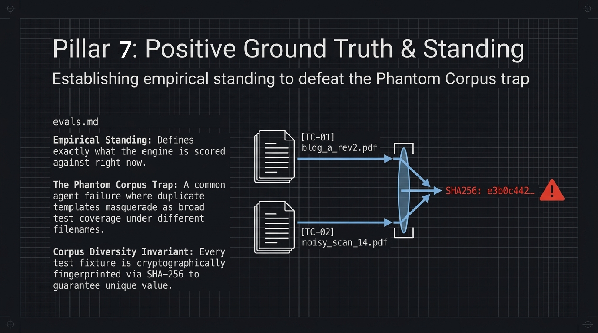
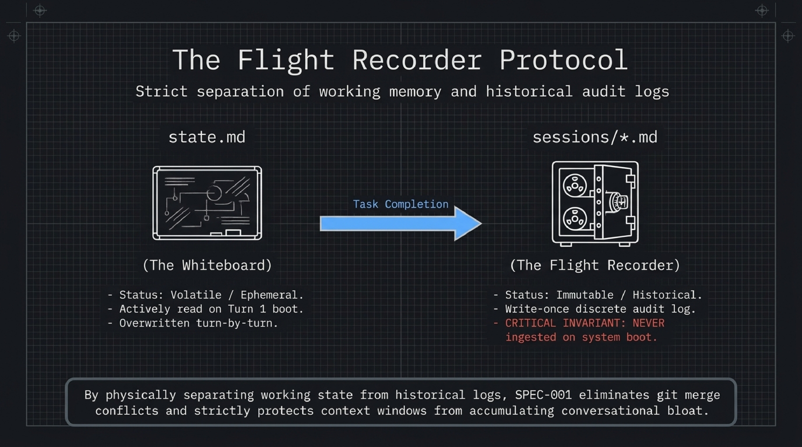
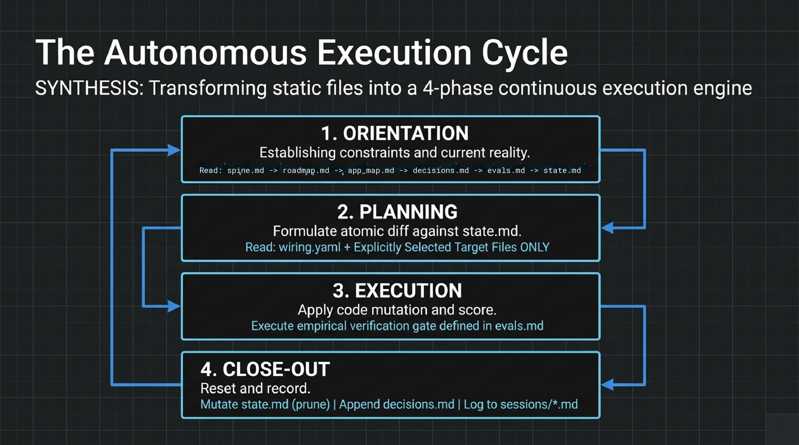
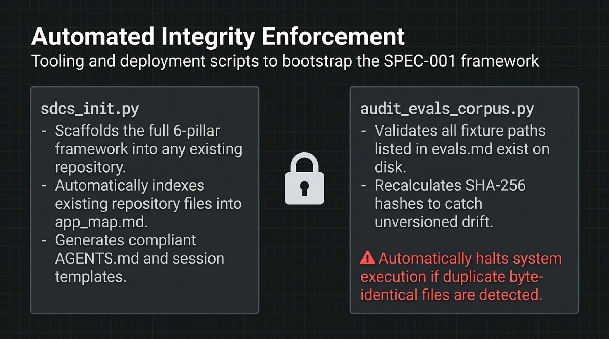

# Spec-Driven Cognitive Scaffolding (SDCS) Framework

[](SPEC-001.md)
[](https://github.com/)
[](https://www.python.org/)
[](LICENSE)
[](#)



A formal, file-based cognitive harness for autonomous agentic software engineering conforming to [SPEC-001](SPEC-001.md).

---

## Specifications

- **[SPEC-001 (v1.2.0)](SPEC-001.md):** Single-Agent Cognitive Harness — The active specification governing repository-level working memory, negative decisions, and cryptographic test verification.

---

## The Problem: The Failure of Monolithic Prompting



Autonomous coding agents typically fail not because of underlying model capability, but because of **context conflation**. When all operational logic, temporary thoughts, file directories, and project history are crammed into a single system prompt or chat log, three fatal pathologies emerge:

1. **Context Drift:** As conversational message counts increase, core architectural constraints and safety rules get diluted and pushed out of the model's effective attention window.
2. **Cartographic Hallucination:** Lacking a persistent, explicit map of the codebase, agents enter token-wasting brute-force search loops (`find`, `grep`) or hallucinate non-existent files and interfaces.
3. **Episodic Amnesia:** Agents possess no structured negative memory. When restarted or encountering a rollback, they repeatedly re-attempt architectural decisions that were already measured and rejected in prior sessions.

> **Root Cause:** Monolithic prompts conflate invariant rules, ephemeral scratchpad state, module cartography, and historical audit logs into a single bloated context window.

---

## The Core Cognitive Topography



SDCS decouples agent cognition into seven purpose-built files plus an isolated flight recorder:

| # | File | Pillar Role | Analogy | Description |
| :-: | :--- | :--- | :--- | :--- |
| **1** | `spine.md` | Constitutional Invariants | **The Law** | Immutable domain axioms, verification gates, and forbidden actions. |
| **2** | `wiring.yaml` | Declarative Topology | **The Mesh** | Component boundaries, service mesh, interface bindings, and contracts. |
| **3** | `roadmap.md` | Acceptance Contract | **The North Star** | High-level human intent vs. measured empirical reality (`[INTENT]` vs `[MEASURED]`). |
| **4** | `state.md` | Dynamic Working Memory | **The Whiteboard** | Active milestone objectives, immediate blockers, and pending gates (~300 token budget). |
| **5** | `app_map.md` | Repository Cartography | **The Compass** | Structural index of modules and responsibilities consulted prior to file access. |
| **6** | `decisions.md` | Negative Episodic Memory | **The Graveyard** | Rejection log of measured dead ends (`Claim` → `Measurement` → `Reopen Condition`). |
| **7** | `evals.md` | Positive Episodic Memory | **The Scorecard** | Benchmark standing, golden test fixtures, and SHA-256 diversity guards. |
| **+** | `sessions/*.md` | Historical Handoff Logs | **The Flight Recorder** | Discrete, immutable post-shift engineering handoffs. Never ingested on system boot. |

---

## Architectural Lineage & Theoretical Foundations

SDCS is not reinventing software theory; it is the deliberate, pragmatic application of battle-tested systems programming, distributed systems primitives, and formal methods adapted to constrain probabilistic LLM context windows. When an autonomous agent is given an unconstrained prompt and bash access, it drifts and rationalizes errors. By grounding agent workflows in classical computer science patterns, we achieve deterministic engineering stability:

* **The Blackboard Pattern** (*Erman, Lesser, Hayes-Roth, & Reddy, 1980*): Implemented in `state.md` to externalize volatile working memory, adopting Carnegie Mellon's *HEARSAY-II* pattern where opportunistic reasoning engines read and mutate an isolated, low-budget whiteboard instead of passing unbounded conversational state.
* **Design by Contract & Formal Invariant Theory** (*Hoare, 1969; Meyer, 1986*): Implemented in `spine.md` as non-negotiable domain axioms, preconditions, and execution gates that cannot be softened, bypassed, or negotiated by agent inference.
* **Modular Information Hiding** (*Parnas, 1972*): Implemented in `wiring.yaml` to enforce explicit component interfaces, runtime contracts, and tool boundaries, containing blast radii and eliminating circular module dependencies.
* **Optative vs. Indicative Requirements & Cybernetic Control** (*Wiener, 1948; Brinch Hansen, 1970; Jackson, 1995*): Implemented in `roadmap.md` to decouple high-level human intent (`[INTENT]`, optative policy) from measured empirical results (`[MEASURED]`, indicative mechanism), preventing teleological drift and proxy metric optimization.
* **Virtual Memory Page Tables & The Working Set Model** (*Denning, 1968; Kruchten, 1995*): Implemented in `app_map.md` as an external index of repository cartography, translating high-level task goals into explicit file paths so agents page only necessary dependencies into context rather than thrashing tokens on recursive filesystem scans.
* **Inverted Architecture Decision Records & Falsification** (*Popper, 1959; Nygard, 2011*): Implemented in `decisions.md` to establish negative episodic memory, inverting classic ADRs into an append-only rejection graveyard that blocks cyclical multi-turn regressions using empirical measurements and concrete reopening criteria.
* **Cryptographic Content Addressing** (*Merkle, 1979*): Implemented in `evals.md` to bind test fixtures and empirical standing to commit hashes and SHA-256 digests, eliminating the "Phantom Corpus" failure mode where duplicate files masquerade as valid coverage.
* **Write-Ahead Logging & Append-Only Ledgers** (*Gray & Reuter, 1992*): Implemented in `sessions/*.md` to physically isolate historical, write-once shift handoff records from the volatile execution loop, preventing context poisoning and eliminating git merge conflicts across parallel agents.

---

## Pillars 1 & 2: Boundary & Topology



Constraining an autonomous agent's operational blast radius requires rigorous, explicit boundaries:

* **`spine.md` (Constitutional Invariants):**
  - Immutable domain axioms that cannot be prompt-negotiated or overridden by agent assumptions.
  - Deterministic verification gates (test runners, linters, coverage baselines).
  - Absolute forbidden actions (e.g., modifying invariant definitions, committing secrets, unvetted destructive file ops).
* **`wiring.yaml` (Declarative Topology):**
  - Maps the service mesh, subsystem interfaces, and package dependency graph.
  - Defines strict tool boundaries and environment runtime contracts.
  - Mandates explicit inputs and outputs across components to eliminate circular import loops.

---

## Pillar 3: The Macro Acceptance Contract (`roadmap.md`)

Without an explicit `roadmap.md`, autonomous agents suffer from **Specification Drift** and **Scope Creep**—they optimize proxy metrics or invent unrequested requirements.

### Key Invariants:
1. **The Strict Dichotomy (`[INTENT]` vs `[MEASURED]`):**
   - **`[INTENT]`**: The human/client's verbatim requirements for acceptance in production. Not negotiable by an agent, and never to be "improved" by agent inference.
   - **`[MEASURED]`**: Empirical numbers, real benchmarks, and verified state directly extracted from tests and code.
2. **Strictly NO Task Queue:**
   - Ephemeral, turn-by-turn tasks belong exclusively in `state.md`.
   - Hand-maintained to-do lists in roadmaps inevitably rot, accumulate stale tasks, and misdirect agents.
3. **Telemetry Freshness:** Every `[MEASURED]` entry must link to a verified commit hash or milestone. Telemetry exceeding the freshness window (30 days / 50 commits) is tagged `[STALE]`.

---

## Pillars 4 & 5: Working Memory & Cartography



Agents frequently burn context windows on recursive filesystem queries. SDCS solves this with a two-tiered spatial memory:

* **`state.md` (The Blackboard - Pillar 4):**
  - Houses ephemeral, turn-by-turn ground truth: current active objective, immediate blockers, and active test gates.
  - **Strict ~300 Token Budget:** Pruned and overwritten after every completed subtask or milestone.
  - Read on Turn 1 boot so the agent immediately knows where it left off without reading conversation history.
* **`app_map.md` (Codebase Cartography - Pillar 5):**
  - A structured index of modules, entry points, and structural responsibilities.
  - **The Golden Rule:** The agent consults `app_map.md` first, reading *only* the specific target files required for the task.
  - Eliminates exhaustive brute-force search loops across large codebases.
  - **Hierarchical Monorepo Scaling:** For enterprise codebases (>50 modules, >1,000 files), root `app_map.md` indexes subsystem interfaces (<1,000 tokens), while individual packages (e.g. `services/auth/app_map.md`) maintain nested cartography loaded on demand.

---

## Symmetric Episodic Memory

Episodic memory must be bidirectional: an agent must know what **failed** just as clearly as what **passed**.

### Pillar 6: Negative Episodic Memory (`decisions.md`)



Without negative episodic memory, an agent encountering an edge case will repeatedly re-attempt hypotheses that failed in earlier sessions. `decisions.md` acts as an auditable **Rejection Graveyard**, enforcing a mandatory 3-part schema:

```markdown
## REJ-014: Morphological Closing Filter on Subfloor Mask

THE CLAIM:
Applying a 5x5 closing filter bridges broken line segments.

THE MEASUREMENT:
Halved room precision from 86.4% -> 43.1%; spawned 14 phantom polygons across bathroom fixtures.

WHAT WOULD REOPEN IT:
Blueprints scanned at < 150 DPI where contour continuity drops below 30%.
```

* **The Claim:** The optimization, algorithm, or refactor attempted.
* **The Measurement:** Empirical metric or test result demonstrating why it failed.
* **What Would Reopen It:** Concrete, falsifiable trigger required before any agent may retry the approach.

---

### Pillar 7: Positive Ground Truth & Standing (`evals.md`)



To prevent the **Phantom Corpus Trap** (where agents report illusory 100% test pass rates across files that are actually duplicate copies or empty templates), `evals.md` enforces cryptographic fixture verification:

* **Empirical Standing:** Defines current verified baseline performance anchored to git commit hashes.
* **Corpus Diversity Invariant:** Every golden benchmark fixture is cryptographically fingerprinted via SHA-256 digests. Duplicate byte-identical files under different names trigger an immediate audit halt.
* **Freshness Contract:** Expiration limits that require re-measuring baseline scores when dependencies or model weights update.

---

## Working Memory vs. Shift Handoff: The Flight Recorder Protocol



A critical failure mode of agent architectures is token exhaustion caused by auto-loading historical conversation logs on boot. SDCS enforces a strict boundary between working memory and historical shift archives:

| Artifact | Role | Lifecycle | Agent Ingestion |
| :--- | :--- | :--- | :--- |
| **`state.md`** | **The Whiteboard** (Active Working Memory) | Constantly overwritten and pruned | **Always read on Turn 1.** Contains only active objectives, immediate blockers, and current verification status (~300 tokens). |
| **`sessions/*.md`** | **The Flight Recorder** (Shift Handoff Log) | Write-once, append-only discrete files | **CRITICAL INVARIANT: NEVER ingested on system boot.** Queried on demand only when an agent needs targeted forensic context. |

### Why Discrete Files Beat One Monolithic `sessions.md`
1. **Zero Git Merge Conflicts:** Concurrent agent workers across separate branches never collide on a shared append-only log.
2. **Deterministic Context Retrieval:** Target specific sessions (e.g., `sessions/2026-09-19_state-machine.md`) via targeted grep instead of ingesting a 30,000-token diary.
3. **Natural Checkpointing:** Every discrete file acts as an immutable, timestamped snapshot of that engineering shift.

---

## The Autonomous Execution Cycle



SDCS transforms passive static files into a deterministic, 4-phase continuous execution engine:

1. **Phase 1: Orientation**
   - Hydrate constraints and current ground truth in strict order:
   - `spine.md` → `roadmap.md` → `app_map.md` → `decisions.md` → `evals.md` → `state.md`.
2. **Phase 2: Planning**
   - Formulate atomic diffs against `state.md`.
   - Read `wiring.yaml` + strictly relevant target files identified via `app_map.md`.
3. **Phase 3: Execution**
   - Apply isolated code mutations.
   - Run empirical verification gates defined in `evals.md` (linters, test suites, benchmarks).
4. **Phase 4: Close-Out**
   - Prune and update `state.md`.
   - Append rejected hypotheses to `decisions.md`.
   - Write an immutable flight recorder log in `sessions/YYYY-MM-DD_<topic>.md`.

---

## Automated Integrity Enforcement



SDCS provides deterministic Python tooling to bootstrap repositories and enforce verification gates:

* **`sdcs_init.py` (`sdcs init`):**
  - Scaffolds the complete 7-pillar framework into any existing repository.
  - Automatically indexes existing files and directory structure into `app_map.md`.
  - Generates compliant `AGENTS.md` behavioral guidance, `sessions/template.md`, and `prompts/grillme.md`.
* **`sdcs grill` (`python sdcs_init.py --grill`):**
  - Emits the `/grillme` adversarial spec elicitation prompt to interview human stakeholders and harden requirements into quantifiable `[INTENT]` contracts before code is generated.
* **`audit_evals_corpus.py` (`sdcs audit`):**
  - Validates that all benchmark fixtures listed in `evals.md` physically exist on disk.
  - Recalculates SHA-256 hashes to catch unversioned drift or corrupted test assets.
  - **Diversity Enforcement:** Automatically halts execution if duplicate byte-identical files masquerade as independent test cases.

---

## Quickstart

### Installation

Install `sdcs` directly from the repository or via `pip`:

```bash
# Editable install for development
pip install -e .

# Or run directly with python
python sdcs_init.py --help
```

### 1. Initialize SDCS in Any Repository

```bash
# Scaffold the 7 pillars + sessions/ + AGENTS.md in repo root
sdcs init

# Or scaffold into a dedicated .agent/ directory
sdcs init --use-agent-dir
```

#### CLI Options
* `--target-dir <path>`: Target repository root path (default: `.`).
* `--use-agent-dir`: Store the 7 pillars and `sessions/` inside `.agent/` instead of the root.
* `--skip-agents-md`: Skip generating the `AGENTS.md` behavioral prompting file.
* `--force`: Overwrite existing files.

---

### 2. Audit Ground Truth Integrity

```bash
# Audit evals.md test fixtures and SHA-256 hashes
sdcs audit

# Or invoke the script directly
python audit_evals_corpus.py
```

* **Asset Reachability:** Verifies referenced fixture paths exist on disk.
* **Cryptographic Accuracy:** Asserts recorded SHA-256 digests match file contents.
* **Corpus Diversity & Anti-Evasion:** Detects both byte-identical files and **near-duplicates** (fixtures differing only by trivial whitespace, empty lines, or dummy formatting padding).
* **Hash Populator:** Automatically computes and displays hashes for rows marked `pending`.

---

### 3. Adversarial Spec Elicitation (`/grillme`)

Deterministic runtime execution requires unambiguous specifications. SDCS includes the **`/grillme` Adversarial Spec Elicitation Protocol** as an authoring tool to eliminate fuzzy requirements:

```bash
# Print the elicitation prompt to copy or pipe into an LLM session
sdcs grill

# Target a specific milestone
sdcs grill --milestone M-002

# Or invoke directly via the bootstrap script
python sdcs_init.py --grill
```

* **Zero Tolerance for Vague Adjectives:** Rejects terms like "fast", "clean", or "scalable".
* **Extracts Hard Ceilings & Floors:** Demands quantitative latency, throughput, memory, and coverage targets.
* **Auto-Populates `roadmap.md`:** Generates structured `[INTENT]` and `[MEASURED]` acceptance criteria.
* **Scaffolded File:** Generated at `prompts/grillme.md` (or `.agent/prompts/grillme.md`).

---

## Operational Scale Profiles

SDCS is built for **autonomous, multi-turn shifts** where context drift causes expensive regressions—not for single-line autocomplete. To prevent ceremony overhead on small tasks, use the appropriate profile:

| Profile | Hydration Set | Token Budget | Ideal For |
| :--- | :--- | :--- | :--- |
| **Lite** | `spine.md` + `state.md` | ~400 tokens | Interactive pair-programming, CSS/typo fixes, quick single-file refactors. |
| **Standard** | `spine.md` + `roadmap.md` + `app_map.md` + `state.md` | ~1,500 tokens | Subsystem feature work, localized refactors, unit test coverage expansion. |
| **Full Shift** | All 7 Pillars + `sessions/template.md` on close-out | ~2,500–3,500 tokens | Autonomous multi-turn agent runs, overnight refactors, cross-subsystem migrations. |

---

## Pragmatic Enforcement & The Permission Boundary

### Defense-in-Depth: Stopping the "Soft Invariant" Hole
When an autonomous agent encounters a failing test gate on Turn 12, a known failure mode is **rationalization**: editing `spine.md` or altering test runner flags to force "task completion." SDCS secures invariants across three distinct architectural layers:

1. **Behavioral Layer (`AGENTS.md`):** Non-negotiable system rules prohibiting invariant tampering.
2. **VCS Pre-Commit Layer (Gate C):** Repository pre-commit hook automatically rejects any commit modifying `spine.md` or `wiring.yaml` unless explicitly bypassed by a human engineer via `export SDCS_ALLOW_CONSTITUTIONAL_MUTATION=1`.
3. **OS / Container Sandbox:** In automated agent environments, `spine.md` and `wiring.yaml` can be locked via `chmod 444` or mounted as read-only volumes (`:ro`).

### Git Hook Modes

| Strategy | Ideal Scenario | Mechanics | Velocity Impact |
| :--- | :--- | :--- | :--- |
| **Behavioral Prompting (`AGENTS.md`)** *(Recommended)* | Solo developers, rapid prototyping, interactive pair programming. | Embeds hydration order and close-out requirements into agent system rules. | **Zero friction.** Keeps you in flow state without blocking terminal commands. |
| **Advisory Git Hook (`sdcs.mode advisory`)** | Teams that want gentle reminders when refactors get large. | Emits terminal warnings on commits ≥ 40 lines without aborting. | **Zero blockage.** Visual feedback without interrupting commit flow. |
| **Strict Git Hook (`sdcs.mode strict`)** | Unattended autonomous loops, background agents, and CI/CD pipelines. | Rejects commits if `state.md` is missing or if constitutional invariants (`spine.md`) were mutated. | **High rigor.** Guarantees memory synchronization and invariant integrity. |

### Activating Git Hooks

```bash
# Configure git to use the repository hooks directory
git config core.hooksPath .githooks

# Select mode: 'advisory' (warning only) or 'strict' (blocking gate)
git config sdcs.mode advisory
```

---

## Author & Citation

If you use SDCS or reference the SPEC-001 architecture in your research, agent frameworks, or production systems, please cite the project:

```bibtex
@software{murphy2026sdcs,
  author = {Murphy, Adam},
  title = {Spec-Driven Cognitive Scaffolding (SPEC-001): A Deterministic Architecture for Autonomous Coding Agents},
  year = {2026},
  version = {v1.2.0},
  publisher = {GitHub},
  howpublished = {\url{https://github.com/adamm285-dev/Spec-Driven-Cognitive-Scaffolding-SDCS}}
}
```

* **Author:** Adam Murphy
* **License:** [MIT](LICENSE)
* **Contributing:** [CONTRIBUTING.md](CONTRIBUTING.md)
* **Security Policy:** [SECURITY.md](SECURITY.md)
