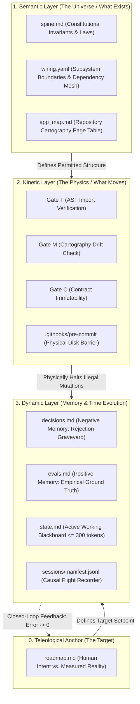
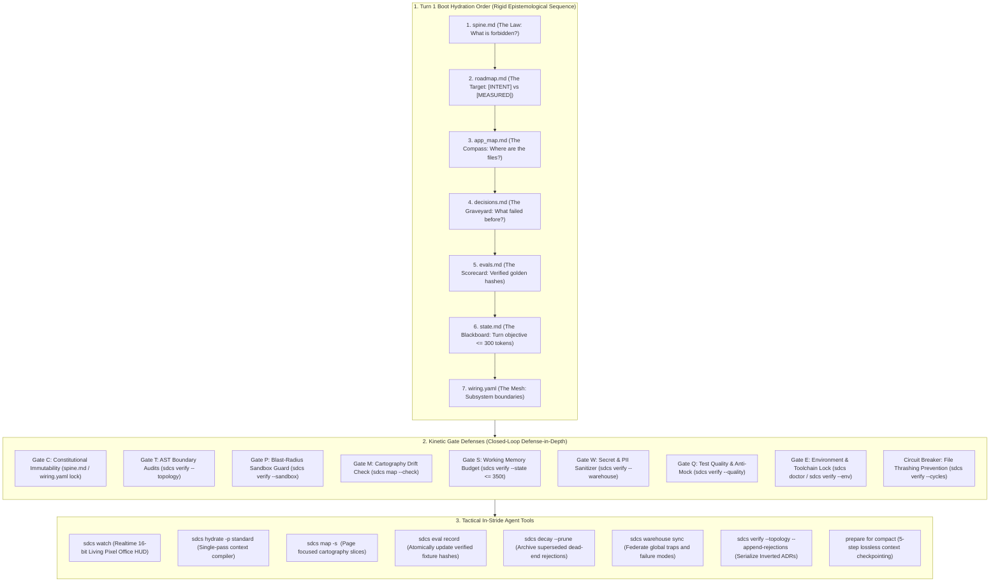
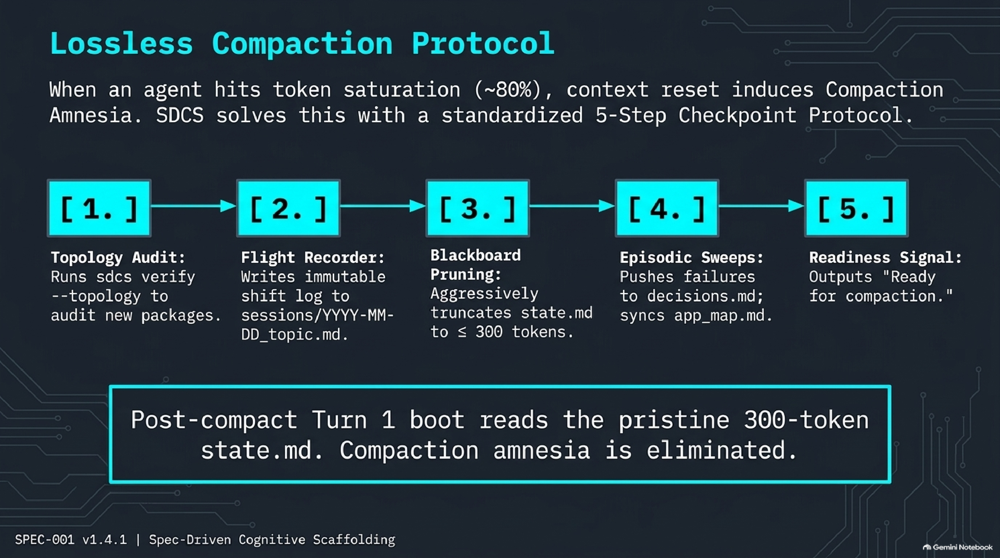
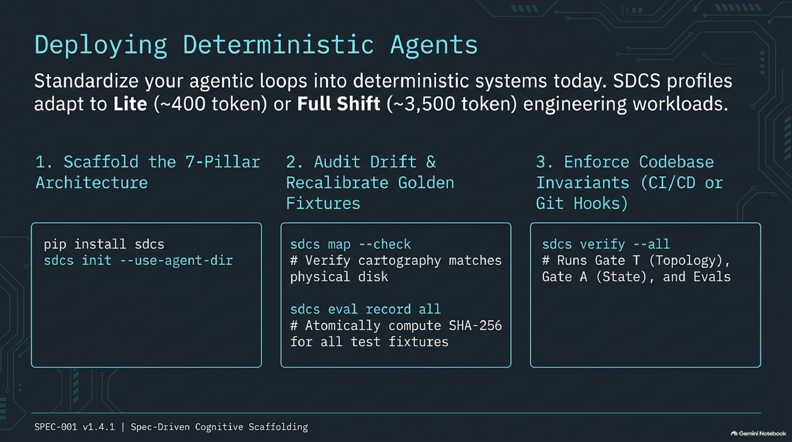

# Spec-Driven Cognitive Scaffolding (SDCS) Framework

[](https://pypi.org/project/sdcs/)
[](SPEC-001.md)
[](https://github.com/adamm285-dev/Spec-Driven-Cognitive-Scaffolding-SDCS/releases/tag/v1.7.0)
[](https://youtu.be/Ap0bXGM0MbU)
[](https://www.python.org/)
[](LICENSE)
[](SPEC-001.md)


A formal, file-based cognitive harness for autonomous agentic software engineering conforming to [SPEC-001](SPEC-001.md).

---

## Specifications

- **[SPEC-001 (v1.7.0)](SPEC-001.md):** Single-Agent Cognitive Harness — The active specification governing repository-level working memory, negative decisions, and cryptographic test verification.

---

## 🏢 The Furnished Office Metaphor: Why SDCS?

> **The Bot** is the *Brain* without arms (LLM reasoning & inference).  
> **The Harness** is the Brain's *arms & hands* (execution loop, shell access, tool calling).  
> **Skills** are the *tools held in the hands* (linters, APIs, test runners, git).  
> **SDCS** is the **Furnished Office** (the constitutional rules on the wall, the floor plan, the central whiteboard, the rejection graveyard, the kinetic bouncer, and the central warehouse).

Without the furnished office, an autonomous agent worker is dropped into an empty, pitch-black room with a box of tools and no lighting. It blindly runs frantic `find` and `grep` loops (burning 2,000 tokens before writing a single line of code), invents non-existent file paths, and repeatedly attempts yesterday's measured failures.

**SDCS provides deterministic lighting for the furnished office:**
1. **The Floor Plan (`app_map.md` & `wiring.yaml`)**: The agent knows the exact layout and boundary contracts before touching code.
2. **The Whiteboard (`state.md`)**: Volatile turn-by-turn memory strictly capped $\le 350$ tokens.
3. **The Rejection Graveyard (`decisions.md`)**: Negative episodic memory stopping the agent from retrying rejected dead ends.
4. **The Scorecard (`evals.md`)**: Cryptographic ground truth anchored to physical test fixtures and SHA-256 hashes.
5. **The Kinetic Bouncer (8 Gates & Circuit Breaker)**: Physical pre-commit guards blocking broken imports, hollow tests, and file oscillations.
6. **The Central Warehouse (`sdcs warehouse`)**: Fleet-wide cognitive federation sharing verified traps without leaking proprietary IP.

---

## 🎙️ Multimedia Deep-Dives & Video Presentations

Prefer listening or watching? Explore the architectural foundations, cybernetic control loops, and combat field lessons behind SDCS:

| Format | Title & Deep-Dive | Direct Resource |
| :--- | :--- | :--- |
| 🎬 **Executive Video** | **Spec-Driven Cognitive Scaffolding: The Architecture of Deterministic AI**<br>Comprehensive video presentation detailing the 4 physical layers, kinetic enforcement gates, and lossless compaction. | [▶️ **Watch on YouTube (1080p)**](https://youtu.be/Ap0bXGM0MbU) |
| 🎧 **Audio Deep-Dive** | **Breaking the Turn 15 Wall with SDCS**<br>Deep-dive podcast discussion examining context conflation, why monolithic prompts fail after turn 15, and how SDCS achieves 50+ turn deterministic stability. | [🎧 **Listen to Podcast (39 MB M4A)**](https://github.com/adamm285-dev/Spec-Driven-Cognitive-Scaffolding-SDCS/releases/download/v1.4.1/Breaking_the_Turn_15_Wall_with_SDCS.m4a) |
| 📊 **Slide Deck** | **Deterministic AI Engineering (12-Slide High-Resolution Cybernetic Deck)**<br>Visual cybernetic reference covering the 7 pillars, 6 kinetic gates, and closed-loop control theory. | [📄 **Download Deck (PDF)**](media/v141slides/Deterministic_AI_Engineering.pdf) |
| 📚 **Knowledge Base** | **Official GitHub Wiki**<br>10-page modular reference suite with SOPs, runbooks, CLI reference, and formal ontology lexicon. | [🌐 **Explore the Wiki**](https://github.com/adamm285-dev/Spec-Driven-Cognitive-Scaffolding-SDCS/wiki) |

---

## The Problem: The Failure of Monolithic Prompting


Autonomous coding agents typically fail not because of underlying model capability, but because of **context conflation**. When all operational logic, temporary thoughts, file directories, and project history are crammed into a single system prompt or chat log, three fatal pathologies emerge:

1. **Context Drift:** As conversational message counts increase, core architectural constraints and safety rules get diluted and pushed out of the model's effective attention window.
2. **Cartographic Hallucination:** Lacking a persistent, explicit map of the codebase, agents enter token-wasting brute-force search loops (`find`, `grep`) or hallucinate non-existent files and interfaces.
3. **Episodic Amnesia:** Agents possess no structured negative memory. When restarted or encountering a rollback, they repeatedly re-attempt architectural decisions that were already measured and rejected in prior sessions.

> **Root Cause:** Monolithic prompts conflate invariant rules, ephemeral scratchpad state, module cartography, and historical audit logs into a single bloated context window.

---

## The Core Cognitive Topography


SDCS decouples agent cognition into seven purpose-built files plus an isolated flight recorder:

| # | File | Pillar Role | Analogy | Description |
| :-: | :--- | :--- | :--- | :--- |
| **1** | `spine.md` | Constitutional Invariants | **The Law** | Immutable domain axioms, verification gates, and forbidden actions. |
| **2** | `wiring.yaml` | Declarative Topology | **The Mesh** | Component boundaries, service mesh, interface bindings, and contracts. |
| **3** | `roadmap.md` | Acceptance Contract | **The North Star** | High-level human intent vs. measured empirical reality (`[INTENT]` vs `[MEASURED]`). |
| **4** | `state.md` | Dynamic Working Memory | **The Whiteboard** | Active milestone objectives, immediate blockers, and pending gates (~300 token budget). |
| **5** | `app_map.md` | Repository Cartography | **The Compass** | Structural index of modules and responsibilities consulted prior to file access. |
| **6** | `decisions.md` | Negative Episodic Memory | **The Graveyard** | Rejection log of measured dead ends (`Claim` → `Measurement` → `Reopen Condition`). |
| **7** | `evals.md` | Positive Episodic Memory | **The Scorecard** | Benchmark standing, golden test fixtures, and SHA-256 diversity guards. |
| **+** | `sessions/*.md` | Historical Handoff Logs | **The Flight Recorder** | Discrete, immutable post-shift engineering handoffs. Never ingested on system boot. |

---

## Architectural Lineage & Theoretical Foundations

SDCS is not reinventing software theory; it is the deliberate, pragmatic application of battle-tested systems programming, distributed systems primitives, and formal methods adapted to constrain probabilistic LLM context windows. When an autonomous agent is given an unconstrained prompt and bash access, it drifts and rationalizes errors. By grounding agent workflows in classical computer science patterns, we achieve deterministic engineering stability:

* **The Blackboard Pattern** (*Erman, Lesser, Hayes-Roth, & Reddy, 1980*): Implemented in `state.md` to externalize volatile working memory, adopting Carnegie Mellon's *HEARSAY-II* pattern where opportunistic reasoning engines read and mutate an isolated, low-budget whiteboard instead of passing unbounded conversational state.
* **Design by Contract & Formal Invariant Theory** (*Hoare, 1969; Meyer, 1986*): Implemented in `spine.md` as non-negotiable domain axioms, preconditions, and execution gates that cannot be softened, bypassed, or negotiated by agent inference.
* **Modular Information Hiding** (*Parnas, 1972*): Implemented in `wiring.yaml` to enforce explicit component interfaces, runtime contracts, and tool boundaries, containing blast radii and eliminating circular module dependencies.
* **Optative vs. Indicative Requirements & Cybernetic Control** (*Wiener, 1948; Brinch Hansen, 1970; Jackson, 1995*): Implemented in `roadmap.md` to decouple high-level human intent (`[INTENT]`, optative policy) from measured empirical results (`[MEASURED]`, indicative mechanism), preventing teleological drift and proxy metric optimization.
* **Virtual Memory Page Tables & The Working Set Model** (*Denning, 1968; Kruchten, 1995*): Implemented in `app_map.md` as an external index of repository cartography, translating high-level task goals into explicit file paths so agents page only necessary dependencies into context rather than thrashing tokens on recursive filesystem scans.
* **Inverted Architecture Decision Records & Falsification** (*Popper, 1959; Nygard, 2011*): Implemented in `decisions.md` to establish negative episodic memory, inverting classic ADRs into an append-only rejection graveyard that blocks cyclical multi-turn regressions using empirical measurements and concrete reopening criteria.
* **Cryptographic Content Addressing** (*Merkle, 1979*): Implemented in `evals.md` to bind test fixtures and empirical standing to commit hashes and SHA-256 digests, eliminating the "Phantom Corpus" failure mode where duplicate files masquerade as valid coverage.
* **Write-Ahead Logging & Append-Only Ledgers** (*Gray & Reuter, 1992*): Implemented in `sessions/*.md` to physically isolate historical, write-once shift handoff records from the volatile execution loop, preventing context poisoning and eliminating git merge conflicts across parallel agents.

---

## Pillars 1 & 2: Boundary & Topology


Constraining an autonomous agent's operational blast radius requires rigorous, explicit boundaries:

* **`spine.md` (Constitutional Invariants):**
  - Immutable domain axioms that cannot be prompt-negotiated or overridden by agent assumptions.
  - Deterministic verification gates (test runners, linters, coverage baselines).
  - Absolute forbidden actions (e.g., modifying invariant definitions, committing secrets, unvetted destructive file ops).
* **`wiring.yaml` (Declarative Topology):**
  - Maps the service mesh, subsystem interfaces, and package dependency graph.
  - Defines strict tool boundaries and environment runtime contracts.
  - Mandates explicit inputs and outputs across components to eliminate circular import loops.

---

## Pillar 3: The Macro Acceptance Contract (`roadmap.md`)


Without an explicit `roadmap.md`, autonomous agents suffer from **Specification Drift** and **Scope Creep**—they optimize proxy metrics or invent unrequested requirements.

### Key Invariants:
1. **The Strict Dichotomy (`[INTENT]` vs `[MEASURED]`):**
   - **`[INTENT]`**: The human/client's verbatim requirements for acceptance in production. Not negotiable by an agent, and never to be "improved" by agent inference.
   - **`[MEASURED]`**: Empirical numbers, real benchmarks, and verified state directly extracted from tests and code.
2. **Strictly NO Task Queue:**
   - Ephemeral, turn-by-turn tasks belong exclusively in `state.md`.
   - Hand-maintained to-do lists in roadmaps inevitably rot, accumulate stale tasks, and misdirect agents.
3. **Telemetry Freshness:** Every `[MEASURED]` entry must link to a verified commit hash or milestone. Telemetry exceeding the freshness window (30 days / 50 commits) is tagged `[STALE]`.

---

## Pillars 4 & 5: Working Memory & Cartography

Agents frequently burn context windows on recursive filesystem queries. SDCS solves this with a two-tiered spatial memory:

* **`state.md` (The Blackboard - Pillar 4):**
  - Houses ephemeral, turn-by-turn ground truth: current active objective, immediate blockers, and active test gates.
  - **Strict ~300 Token Budget:** Pruned and overwritten after every completed subtask or milestone.
  - Read on Turn 1 boot so the agent immediately knows where it left off without reading conversation history.
* **`app_map.md` (Codebase Cartography - Pillar 5):**
  - A structured index of modules, entry points, and structural responsibilities.
  - **The Golden Rule:** The agent consults `app_map.md` first, reading *only* the specific target files required for the task.
  - Eliminates exhaustive brute-force search loops across large codebases.
  - **Hierarchical Monorepo Scaling:** For enterprise codebases (>50 modules, >1,000 files), root `app_map.md` indexes subsystem interfaces (<1,000 tokens), while individual packages (e.g. `services/auth/app_map.md`) maintain nested cartography loaded on demand.

---

## Symmetric Episodic Memory


Episodic memory must be bidirectional: an agent must know what **failed** just as clearly as what **passed**.

### Pillar 6: Negative Episodic Memory (`decisions.md`)

Without negative episodic memory, an agent encountering an edge case will repeatedly re-attempt hypotheses that failed in earlier sessions. `decisions.md` acts as an auditable **Rejection Graveyard**, enforcing a mandatory 3-part schema:

```markdown
## REJ-014: Morphological Closing Filter on Subfloor Mask

THE CLAIM:
Applying a 5x5 closing filter bridges broken line segments.

THE MEASUREMENT:
Halved room precision from 86.4% -> 43.1%; spawned 14 phantom polygons across bathroom fixtures.

WHAT WOULD REOPEN IT:
Blueprints scanned at < 150 DPI where contour continuity drops below 30%.
```

* **The Claim:** The optimization, algorithm, or refactor attempted.
* **The Measurement:** Empirical metric or test result demonstrating why it failed.
* **What Would Reopen It:** Concrete, falsifiable trigger required before any agent may retry the approach.

---

### Pillar 7: Positive Ground Truth & Standing (`evals.md`)

To prevent the **Phantom Corpus Trap** (where agents report illusory 100% test pass rates across files that are actually duplicate copies or empty templates), `evals.md` enforces cryptographic fixture verification:

* **Empirical Standing:** Defines current verified baseline performance anchored to git commit hashes.
* **Corpus Diversity Invariant:** Every golden benchmark fixture is cryptographically fingerprinted via SHA-256 digests. Duplicate byte-identical files under different names trigger an immediate audit halt.
* **Freshness Contract:** Expiration limits that require re-measuring baseline scores when dependencies or model weights update.

---

## Working Memory vs. Shift Handoff: The Flight Recorder Protocol


A critical failure mode of agent architectures is token exhaustion caused by auto-loading historical conversation logs on boot. SDCS enforces a strict boundary between working memory and historical shift archives:

| Artifact | Role | Lifecycle | Agent Ingestion |
| :--- | :--- | :--- | :--- |
| **`state.md`** | **The Whiteboard** (Active Working Memory) | Constantly overwritten and pruned | **Always read on Turn 1.** Contains only active objectives, immediate blockers, and current verification status (~300 tokens). |
| **`sessions/*.md`** | **The Flight Recorder** (Shift Handoff Log) | Write-once, append-only discrete files | **CRITICAL INVARIANT: NEVER ingested on system boot.** Queried on demand only when an agent needs targeted forensic context. |

### Why Discrete Files Beat One Monolithic `sessions.md`
1. **Zero Git Merge Conflicts:** Concurrent agent workers across separate branches never collide on a shared append-only log.
2. **Deterministic Context Retrieval:** Target specific sessions (e.g., `sessions/2026-09-19_state-machine.md`) via targeted grep instead of ingesting a 30,000-token diary.
3. **Natural Checkpointing:** Every discrete file acts as an immutable, timestamped snapshot of that engineering shift.

---

## The Operational Ontology & Autonomous Execution Cycle


SDCS models the codebase not as arbitrary files, but as an **operational cybernetic ontology** operating across three physical layers governed by an external setpoint:



### The 4-Phase Continuous Execution Engine


The agent executes every turn through a deterministic, 4-phase continuous engine operating directly within this ontology:

| Execution Phase | Operational Actions | Interacting Ontological Layer |
| :--- | :--- | :--- |
| **Phase 1: Orientation** | Hydrate constraints and ground truth in strict sequence: `spine.md` → `roadmap.md` → `app_map.md` → `decisions.md` → `evals.md` → `state.md`. | **Semantic Layer** (`spine.md`, `app_map.md`) to establish what exists.<br>**Dynamic Layer** (`decisions.md`, `evals.md`, `state.md`) to load memory. |
| **Phase 2: Planning** | Formulate atomic diffs against `state.md`. Read `wiring.yaml` + strictly relevant target files identified via `app_map.md`. | **Semantic Layer** (`wiring.yaml`) to verify that the proposed import topology is valid. |
| **Phase 3: Execution** | Apply code mutations and run empirical test/linter gates. | **Kinetic Layer** (`Gate T` & git hooks): AST parser physically blocks illegal imports.<br>**Dynamic Layer** (`evals.md`): Benchmark telemetry scores delta. |
| **Phase 4: Close-Out** | Prune `state.md` ($\le 300$ tokens), record rejections in `decisions.md`, and log shift handoff in `sessions/`. | **Dynamic Layer** (`decisions.md`, `state.md`, `sessions/*.md`): Updates closed-loop state for subsequent turns. |

---

## How the Autonomous Agent Understands & Executes SDCS Upgrades

An autonomous coding agent operating inside SDCS does not view the repository as a loose collection of folders and scripts. Governed by [`AGENTS.md`](AGENTS.md), the LLM adopts a **deterministic cybernetic mindset** structured around strict epistemological rules, kinetic boundaries, and memory feedback loops.



### 1. Turn 1 Boot Hydration Order: Why the Sequence is Rigid

When an agent initializes or restarts after a context reset, it MUST hydrate state across the 7 cognitive pillars in an exact, non-negotiable sequence. This sequence prevents hallucination, context dilution, and premature planning:

1. **`spine.md` (The Law - Invariants & Forbidden Actions):**
   *Why First:* The agent must know what it is physically forbidden from doing (e.g. tampering with test definitions, committing secrets, altering invariants) *before* it considers what to build.
2. **`roadmap.md` (The North Star - The Target Setpoint):**
   *Why Second:* Establishes the macro mission. The agent reads the active milestone and identifies the cybernetic delta: `Δ = [INTENT] - [MEASURED]`. Its sole objective is driving this delta to zero.
3. **`app_map.md` (The Compass - Repository Cartography):**
   *Why Third:* Provides an explicit page table of physical file paths. The agent resolves target file locations immediately—completely eliminating expensive `find` or `grep` search loops.
4. **`decisions.md` (The Graveyard - Negative Episodic Memory):**
   *Why Fourth:* Informs the agent of previously measured dead ends (`Claim` → `Measurement` → `Reopen Condition`). The agent is epistemologically primed *never* to retry an architecture that already failed in prior turns.
5. **`evals.md` (Positive Ground Truth - Cryptographic Scorecard):**
   *Why Fifth:* Ingests current empirical benchmark standing and golden SHA-256 fixture locks, establishing ground truth reality.
6. **`state.md` (The Blackboard - Active Working Memory):**
   *Why Sixth:* Hydrates the immediate turn-by-turn context: current subtask objective, active blockers, and pending verification gates ($\le 350$ tokens).
7. **`wiring.yaml` (The Mesh - Declarative Topology):**
   *Why Seventh:* Ingests component boundaries, service mesh interfaces, and forbidden import edges immediately prior to proposing code diffs in Phase 2 (Planning).

> **The +1 Flight Recorder Invariant:**
> The agent is **strictly prohibited from auto-loading `sessions/*.md` on boot**. Historical shift handoffs are immutable, write-once flight logs. Loading them on boot recreates conversational bloat, pollutes working memory, and triggers context drift. Instead, agents query `sessions/manifest.jsonl` on-demand via `sdcs session list --query <topic>` only when forensic debugging is required.

---

### 2. Navigating the Kinetic Gates: Closed-Loop Defense-in-Depth


Un-scaffolded agents often enter argumentative rationalization loops when encountering test failures—they rewrite tests, comment out assertions, or edit system rules. In SDCS v1.7.0, the agent treats repository constraints as **physical laws of motion** organized across spatial, cognitive, and epistemic defense tiers:

| Defense Tier | Gate | Name | Enforcement Trigger | Physical Failure Prevented |
| :--- | :--- | :--- | :--- | :--- |
| **Spatial & Structural** | **Gate C** | Constitutional Immutability | `.githooks/pre-commit` | Unauthorized tampering with `spine.md` or `wiring.yaml`. |
| **Spatial & Structural** | **Gate T** | Topological Invariant Gate | `sdcs verify --topology` | Prohibited AST cross-subsystem imports violating `wiring.yaml`. |
| **Spatial & Structural** | **Gate P** | Blast-Radius Sandbox Guard | `sdcs verify --sandbox` | Staging modifications within declared `protected_paths`. |
| **Spatial & Structural** | **Gate M** | Cartography Drift Gate | `sdcs map --check` | Commits with untracked new files or orphaned paths in `app_map.md`. |
| **Cognitive & Temporal** | **Gate S** | Working Memory Budget Gate | `sdcs verify --state` | Context window amnesia (`state.md` > 350 tokens) & subagent lifecycle. |
| **Cognitive & Fleet** | **Gate W** | Secret & PII Sanitizer | `sdcs warehouse publish` | Leaking API keys, tokens, emails, or IPs to central warehouse. |
| **Epistemic & Quality** | **Gate Q** | Test Quality & Anti-Mock Gate | `sdcs verify --quality` | "Hollow tests" asserting `True`, assertless tests, or swallowed exceptions. |
| **Epistemic & Toolchain** | **Gate E** | Toolchain & Environment Gate | `sdcs doctor` / `--env` | Blaming valid application code for local runtime or interpreter drift. |
| **Kinetic Circuit** | **Breaker** | The Circuit Breaker | `sdcs verify --cycles` | Alternating period-2 file thrashing ($A \to B \to A \to B$) and infinite token loops. |

#### Kinetic Defenses in Action: Automated Inverted ADR Serialization



When an agent encounters a Gate T boundary violation during code generation, it follows a zero-argumentation protocol:
1. **Physical AST Rejection:** Gate T statically audits the AST and blocks the commit with `exit 1`.
2. **Automated Memory Serialization:** The agent invokes `sdcs verify --topology --append-rejections`, which extracts monotonic IDs and serializes an Inverted ADR (`## REJ-XXX`) conforming to the **Claim $\rightarrow$ Measurement $\rightarrow$ Reopen Condition** schema directly into `decisions.md`.
3. **Epistemological Reflection:** The rejection record remains unstaged on disk, forcing the agent to reflect upon the negative memory and refactor via dependency inversion or interface decoupling.

---

### 3. Subsystem Cartography Slicing (`sdcs map -s`)

In enterprise monorepos or multi-module projects (>100 files), ingesting the entire `app_map.md` consumes valuable context tokens. SDCS v1.4.1 gives agents **cartographic paging**:

```bash
# Agent pages only the proxy subsystem cartography into its working context
sdcs map --subsystem proxy
# (or: sdcs map -s src/sdcs)
```

The agent resolves subsystem boundaries declared in `wiring.yaml` to their physical directories and extracts an isolated, high-density Markdown page table. This reduces cartographic token consumption by up to **85%** on large repositories.

---

### 4. First-Class Baseline Recalibration (`sdcs eval record`)

When legitimate engineering refactors or milestone upgrades intentionally alter test fixtures or benchmark scores, agents in v1.4.1 use a first-class recalibration protocol:

```bash
# Atomically recalibrate a single fixture's SHA-256 digest in evals.md
sdcs eval record TC-001

# Recalibrate all registered fixtures simultaneously
sdcs eval record all
```

- **Anti-Phantom Corpus Protection:** Computes normalized SHA-256 digests (stripping trivial whitespace and dummy comments) to guarantee that test fixtures are genuine, diverse benchmarks.
- **Zero Manual Editing:** The agent never manually edits hash columns in Markdown tables, eliminating human error and accidental table corruption.

---

### 5. Mid-Shift Checkpoint Protocol ("prepare for compact")

When pair programming sessions approach context saturation (~70–80%), or when the developer issues `"prepare for compact"` before running `/compact` or resetting chat, the agent executes a standardized 5-step checklist:

1. **Topology Audit:** Runs `sdcs verify --topology` to verify all new packages are declared in `wiring.yaml`.
2. **Flight Recorder Snapshot:** Appends an immutable log to `sessions/YYYY-MM-DD_<topic>.md` capturing completed work, test standing, and post-compact next actions. Syncs `sessions/manifest.jsonl` via `sdcs session index`.
3. **Blackboard Pruning:** Overwrites `state.md` strictly to $\le 300$ tokens containing only `## Current Objective`, `## Status & Gate Verification`, and `## Immediate Next Action (Post-Compact)`.
4. **Episodic Memory Sweeps:** Logs rejected experiments to `decisions.md` and synchronizes cartography with `sdcs map --sync`.
5. **Readiness Signal:** Emits confirmation: *"Ready for compaction."*

Post-compact Turn 1 boot reads the pristine $\le 300$-token `state.md`, completely eliminating **Compaction Amnesia**.

---

### 6. The Mandatory Shift Close-Out Protocol

Before an agent declares any task complete or stages files at the end of an engineering shift, it executes the mandatory close-out sequence:
1. Prune and overwrite `state.md` with current verification status ($\le 300$ tokens via `sdcs verify --state`).
2. Update `roadmap.md` `[MEASURED]` blocks with empirical test numbers and commit hashes.
3. Serialize any failed attempts or rejected architectures to `decisions.md`.
4. Verify cartography matches disk via Gate M (`sdcs map --check` / `sdcs map --sync`).
5. Verify topology complies with `wiring.yaml` via Gate T (`sdcs verify --topology`).
6. Append an immutable flight recorder log in `sessions/YYYY-MM-DD_<topic>.md` and sync index (`sdcs session index`).

---

## Lossless Compaction: The "Prepare for Compact" Protocol


In long engineering sessions spanning dozens of turns, AI context windows inevitably fill up. Development environments (such as Claude Code's `/compact`, Cursor chat resets, Aider history truncations, or LLM context window roll-offs) periodically summarize or prune the conversation transcript. When an un-scaffolded agent undergoes compaction, it suffers from **Compaction Amnesia**: active hypothesis chains, test gate states, unrecorded dead ends, and mental model cartography are wiped out. The agent wakes up on post-compact Turn 1 confused, prone to regression, and repeating measured errors.

SDCS eliminates Compaction Amnesia through the **Mid-Shift Checkpoint Protocol ("prepare for compact")** and the **Wiring Mutation Invariant (Pillar 2)**.

### The Operational Dimensions: Why, When, Where, and How

| Dimension | Specification Contract | Operational Details |
| :--- | :--- | :--- |
| **WHY** | **Lossless Memory Persistence & Boundary Guard** | Guarantees zero context loss across context window compactions. Externalizes fine-grained findings into the immutable flight recorder while keeping active working memory trimmed to $\le 300$ tokens so post-compact Turn 1 hydration is instant, focused, and drift-free. |
| **WHEN** | **1. Human Trigger:** `"prepare for compact"`<br>**2. Context Saturation (~70–80%)**<br>**3. Mid-Shift Milestone Completion** | Triggered mid-shift whenever the developer issues the command `"prepare for compact"` before running `/compact`, or whenever token usage approaches window capacity during multi-hour pair programming. |
| **WHERE** | **Cross-Pillar Synchronization:**<br>• `wiring.yaml` (Pillar 2)<br>• `sessions/*.md` (+1 Flight Recorder)<br>• `state.md` (Pillar 4)<br>• `decisions.md` (Pillar 6)<br>• `app_map.md` (Pillar 5)<br>• `roadmap.md` (Pillar 3) | Checkpoints are written to physical disk files before memory is cleared:<br>1. `wiring.yaml`: Audited and updated in-stride for newly introduced subsystems.<br>2. `sessions/YYYY-MM-DD_<topic>.md`: Discrete immutable flight recorder log.<br>3. `state.md`: Aggressively pruned strictly to $\le 300$ tokens.<br>4. `decisions.md`: Rejections and dead ends logged.<br>5. `app_map.md`: Synced with new/modified file paths.<br>6. `roadmap.md`: `[MEASURED]` telemetry logged if milestones were met. |
| **HOW** | **5-Step Automated Execution Cycle** | The agent mechanically executes a standardized 5-step checklist and emits an explicit readiness signal before compaction proceeds. |

### How It Works: The 5-Step Checkpoint Execution

```
[Developer: "prepare for compact" or Token Saturation Nears]
                             │
                             ▼
  1. Topology & Subsystem Audit  ──► Runs `sdcs verify --topology` to audit wiring.yaml
                             │
                             ▼
  2. Flight Recorder Snapshot    ──► Writes immutable log to `sessions/YYYY-MM-DD_<topic>.md`
                             │
                             ▼
  3. Blackboard Pruning          ──► Prunes `state.md` to ≤ 300 tokens (Objective + Gate + Next Action)
                             │
                             ▼
  4. Episodic Memory Sweeps      ──► Records failed approaches to `decisions.md` & updates `app_map.md`
                             │
                             ▼
  5. Compact Readiness Signal    ──► Emits confirmation: "Ready for compaction." (Proceed to /compact)
```

### In-Stride Updates: The Wiring Mutation Invariant (Pillar 2)

During extended engineering sessions, agents often add new packages or refactor module hierarchies. SDCS defines precise rules for when and how agents interact with `wiring.yaml`:

* **In-Stride Updates (Additive):** When the agent creates new subsystems, packages, or modules, it **MUST update `wiring.yaml` in-stride** (in the same step/commit as code creation). This ensures that new components have declared boundary contracts before Gate T AST verification runs.
* **Prohibited Relaxation (Bypasses & Cycles):** Modifying `wiring.yaml` to relax existing architectural boundaries, add circular dependencies, or bypass Gate T rejections without explicit human authorization (`SDCS_ALLOW_INVARIANT_MUTATION=1`) is strictly forbidden. If an import fails Gate T, the agent must decouple via dependency inversion or serialize the failure as an Inverted ADR (`## REJ-XXX`) into `decisions.md`.

---

## Automated Integrity Enforcement



SDCS provides deterministic Python tooling to bootstrap repositories and enforce verification gates:

* **`sdcs init` (`python sdcs_init.py`):**
  - Scaffolds the complete 7-pillar framework into any existing repository.
  - Automatically indexes existing files and directory structure into `app_map.md`.
  - Generates compliant `AGENTS.md` behavioral guidance, `sessions/template.md`, and `prompts/grillme.md`.
* **`sdcs audit` & `sdcs eval` (`audit_evals_corpus.py` & `src/sdcs/audit.py`):**
  - Validates that all benchmark fixtures listed in `evals.md` physically exist on disk.
  - Computes normalized SHA-256 digests (anti-evasion whitespace/comment invariant).
  - **Diversity Enforcement:** Halts execution if duplicate files masquerade as independent test cases.
  - **First-Class Recalibration:** `sdcs eval record <ID>|all` (and `sdcs audit --recalibrate`) computes new digests and updates `evals.md` rows directly in one pass.
* **`sdcs map` (`src/sdcs/map.py`):**
  - Audits tracked codebase files against `app_map.md` cartography (`--check`).
  - Synchronizes `app_map.md` in-stride with disk additions and deletions (`--sync`), preserving developer annotations.
  - **Subsystem Cartography Paging:** `--subsystem <path|name>` (`-s`) outputs focused slices of `app_map.md` for specific packages or subsystems, slashing context token consumption in large codebases.
* **`sdcs verify` (`src/sdcs/verifier/`):**
  - **Gate T (Topology):** Statically audits AST imports against `wiring.yaml` boundaries without runtime execution (`--topology`, `--append-rejections`).
  - **Gate A (Working Memory):** Lints `state.md` token budget ($\le 350$ tokens) and verifies canonical 3-section schema (`--state`, `--max-tokens`).
* **`sdcs session` (`src/sdcs/session.py`):**
  - Indexes historical shift handoffs into single-line metadata (`sessions/manifest.jsonl`).
  - Queries session history without violating the Flight Recorder Invariant (never loading raw session prose on boot).
* **`sdcs graph` (`src/sdcs/graph.py`):**
  - Renders `wiring.yaml` subsystem contracts into visual Mermaid diagrams or ASCII terminal DAGs.
* **`sdcs grill` (`python sdcs_init.py --grill`):**
  - Emits the `/grillme` adversarial spec elicitation prompt to interview human stakeholders and harden requirements into quantifiable `[INTENT]` contracts before code is generated.

---

## Quickstart

### Installation

Install `sdcs` directly from [PyPI](https://pypi.org/project/sdcs/) via `pip`:

```bash
pip install sdcs
```

*(Alternatively, you can install directly from GitHub, clone for local development, or run the zero-dependency standalone script):*

```bash
# Direct from GitHub
pip install git+https://github.com/adamm285-dev/Spec-Driven-Cognitive-Scaffolding-SDCS.git

# Or clone and install locally for development
git clone https://github.com/adamm285-dev/Spec-Driven-Cognitive-Scaffolding-SDCS.git
cd Spec-Driven-Cognitive-Scaffolding-SDCS
pip install -e .

# Or run the zero-dependency standalone script directly
python sdcs_init.py --help
```

### 1. Initialize SDCS in Any Repository

```bash
# Scaffold the 7 pillars + sessions/ + AGENTS.md in repo root
sdcs init

# Or scaffold into a dedicated .agent/ directory
sdcs init --use-agent-dir
```

#### CLI Options
* `--target-dir <path>`: Target repository root path (default: `.`).
* `--use-agent-dir`: Store the 7 pillars and `sessions/` inside `.agent/` instead of the root.
* `--hierarchical`: Generate hierarchical multi-tiered cartography maps for large monorepos.
* `--skip-agents-md`: Skip generating the `AGENTS.md` behavioral prompting file.
* `--force`: Overwrite existing files.

---

### 2. Audit Ground Truth & Recalibrate Fixtures

```bash
# Audit evals.md test fixtures and SHA-256 hashes
sdcs audit

# Automatically replace 'pending' entries with computed hashes
sdcs audit --update-pending

# Recalibrate a specific fixture with newly computed SHA-256 digest
sdcs eval record TC-001
# (or: sdcs audit --recalibrate TC-001)

# Recalibrate all registered fixtures simultaneously
sdcs eval record all
```

* **Asset Reachability:** Verifies referenced fixture paths exist on disk.
* **Cryptographic Accuracy:** Asserts recorded SHA-256 digests match file contents.
* **Corpus Diversity & Anti-Evasion:** Detects both byte-identical files and **near-duplicates** (fixtures differing only by trivial whitespace, empty lines, or dummy formatting padding).
* **One-Step Recalibration:** Eliminates the manual edit-to-`pending` dance when updating test fixtures.

---

### 3. Verify Codebase Invariants (Topology & Working Memory)

```bash
# Statically audit codebase imports against wiring.yaml subsystem boundaries (Gate T)
sdcs verify --topology

# Automatically format boundary violations into inverted ADRs (## REJ-XXX)
# and append them directly to decisions.md
sdcs verify --topology --append-rejections

# Audit working memory state.md token budget (Gate A, default <= 350 tokens)
sdcs verify --state

# Enforce custom token ceiling
sdcs verify --state --max-tokens 300

# Run all verification checks (topology, working memory, and evals)
sdcs verify --all
```

* **Zero Execution Risk:** Audits Abstract Syntax Trees (AST) using Python's standard `ast` module without importing or executing runtime code.
* **Negative Memory Serialization:** Programmatically binds architectural failures to Pillar 6 (`decisions.md`) using the strict **Claim $\rightarrow$ Measurement $\rightarrow$ Reopen Condition** schema.
* **Working Memory Discipline:** Prevents context exhaustion by halting when `state.md` exceeds 350 tokens prior to compaction.

---

### 4. Cartography Drift Detection, Synchronization & Paging

```bash
# Check if new or deleted files caused app_map.md to drift (exit code 1 if drift found)
# Enforced automatically by Gate M in .githooks/pre-commit
sdcs map --check

# Synchronize app_map.md with disk, preserving existing annotations
sdcs map --sync

# Page a focused cartography slice for a specific subsystem or directory prefix
sdcs map --subsystem proxy
sdcs map -s src/sdcs
```

---

### 5. Structured Flight Recorder Querying

```bash
# Index historical sessions into sessions/manifest.jsonl
sdcs session index

# List recent sessions in an aligned terminal table
sdcs session list

# Forensically query sessions by keyword or milestone
sdcs session list --query "GPU"

# Output structured records as JSON
sdcs session list --json
```

---

### 6. Declarative Topology Graph Visualizer

```bash
# Render ASCII directed acyclic graph in terminal
sdcs graph --format ascii

# Export Mermaid diagram for documentation or GitHub markdown
sdcs graph --format mermaid --output docs/topology.mmd
```

---

### 7. Adversarial Spec Elicitation (`/grillme`)

Deterministic runtime execution requires unambiguous specifications. SDCS includes the **`/grillme` Adversarial Spec Elicitation Protocol** as an authoring tool to eliminate fuzzy requirements:

```bash
# Print the elicitation prompt to copy or pipe into an LLM session
sdcs grill

# Target a specific milestone
sdcs grill --milestone M-002

# Or invoke directly via the bootstrap script
python sdcs_init.py --grill
```

* **Zero Tolerance for Vague Adjectives:** Rejects terms like "fast", "clean", or "scalable".
* **Extracts Hard Ceilings & Floors:** Demands quantitative latency, throughput, memory, and coverage targets.
* **Auto-Populates `roadmap.md`:** Generates structured `[INTENT]` and `[MEASURED]` acceptance criteria.
* **Scaffolded File:** Generated at `prompts/grillme.md` (or `.agent/prompts/grillme.md`).

---

### 8. Live Telemetry & Event Streaming (`sdcs watch`) *(Experimental)*

```bash
# Launch the background telemetry server & local interface (default http://127.0.0.1:8765)
sdcs watch

# Run in headless mode or on a custom port
sdcs watch --no-browser --port 8765
```

A lightweight, zero-dependency local HTTP and Server-Sent Events (SSE) server that monitors cognitive files (`state.md`, `evals.md`, `decisions.md`) and streams real-time repository telemetry to a local interface during autonomous shifts.

---

## Operational Scale Profiles

SDCS is built for **autonomous, multi-turn shifts** where context drift causes expensive regressions—not for single-line autocomplete. To prevent ceremony overhead on small tasks, use the appropriate profile:

| Profile | Hydration Set | Token Budget | Ideal For |
| :--- | :--- | :--- | :--- |
| **Lite** | `spine.md` + `state.md` | ~400 tokens | Interactive pair-programming, CSS/typo fixes, quick single-file refactors. |
| **Standard** | `spine.md` + `roadmap.md` + `app_map.md` + `state.md` | ~1,500 tokens | Subsystem feature work, localized refactors, unit test coverage expansion. |
| **Full Shift** | All 7 Pillars + `sessions/template.md` on close-out | ~2,500–3,500 tokens | Autonomous multi-turn agent runs, overnight refactors, cross-subsystem migrations. |

---

## Pragmatic Enforcement & The Permission Boundary

### Defense-in-Depth: Stopping the "Soft Invariant" Hole
When an autonomous agent encounters a failing test gate on Turn 12, a known failure mode is **rationalization**: editing `spine.md` or altering test runner flags to force "task completion." SDCS secures invariants across distinct architectural layers:

1. **Behavioral Layer (`AGENTS.md`):** Non-negotiable system rules commanding hydration order and mid-shift checkpoints.
2. **Constitutional Invariant Gate (Gate C):** Pre-commit hook automatically rejects commits modifying `spine.md` or `wiring.yaml` unless explicitly authorized via `SDCS_ALLOW_CONSTITUTIONAL_MUTATION=1`.
3. **Topological Invariant Gate (Gate T):** AST-level static import audit ensuring code respects `wiring.yaml` subsystem boundaries, serializing violations into `decisions.md`.
4. **Blast-Radius Sandbox Guard (Gate P):** Verifies staged files against declarative `protected_paths` in `wiring.yaml` (`sdcs verify --sandbox`).
5. **Cartography Drift Gate (Gate M):** Pre-commit verification (`sdcs map --check`) asserting zero unmapped or orphaned files in `app_map.md` before code can be staged.
6. **Working Memory Budget Gate (Gate S):** Token-budget linter guaranteeing `state.md` never exceeds 350 tokens (`sdcs verify --state`), preventing context window saturation.
7. **Secret & PII Sanitizer (Gate W):** Static scanner blocking sensitive API keys, bearer tokens, emails, phone numbers, and routable IPs from being committed or published (`sdcs verify --warehouse`).
8. **Test Quality & Anti-Mock Gate (Gate Q):** Static AST auditor blocking trivial assertions (`assert True`), assertless test functions, and swallowed exceptions (`sdcs verify --quality`).
9. **Toolchain & Environment Lock (Gate E & `sdcs doctor`):** Diagnoses interpreter versions, tools, and 7-pillar health to prevent agents from blaming working application code on environment drift (`sdcs doctor`, `sdcs verify --env`).
10. **The Circuit Breaker:** Static transition-graph analyzer halting alternating period-2 file oscillations ($A \to B \to A \to B$) and infinite token-thrashing loops (`sdcs verify --cycles`).
11. **OS / Container Sandbox:** In automated agent environments, `spine.md` and `wiring.yaml` can be locked via `chmod 444` or mounted as read-only volumes (`:ro`).

### Git Hook Modes

| Strategy | Ideal Scenario | Mechanics | Velocity Impact |
| :--- | :--- | :--- | :--- |
| **Behavioral Prompting (`AGENTS.md`)** *(Recommended)* | Solo developers, rapid prototyping, interactive pair programming. | Embeds hydration order, wiring invariants, and mid-shift checkpoint ("prepare for compact") protocols into agent system rules. | **Zero friction.** Keeps you in flow state without blocking terminal commands. |
| **Advisory Git Hook (`sdcs.mode advisory`)** | Teams that want gentle reminders when refactors get large. | Emits terminal warnings on commits ≥ 40 lines without aborting. | **Zero blockage.** Visual feedback without interrupting commit flow. |
| **Strict Git Hook (`sdcs.mode strict`)** | Unattended autonomous loops, background agents, and CI/CD pipelines. | Rejects commits if `state.md` is missing, cartography drifts (Gate M), constitutional invariants are mutated (Gate C), AST topology boundaries are breached (Gate T), tests are hollow (Gate Q), or secrets are leaked (Gate W). | **High rigor.** Guarantees memory synchronization and invariant integrity. |

### Activating Git Hooks

```bash
# Configure git to use the repository hooks directory
git config core.hooksPath .githooks

# Select mode: 'advisory' (warning only) or 'strict' (blocking gate)
git config sdcs.mode advisory
```

---

## Author & Citation

If you use SDCS or reference the SPEC-001 architecture in your research, agent frameworks, or production systems, please cite the project:

```bibtex
@software{murphy2026sdcs,
  author = {Murphy, Adam},
  title = {Spec-Driven Cognitive Scaffolding (SPEC-001): A Deterministic Architecture for Autonomous Coding Agents},
  year = {2026},
  version = {v1.7.0},
  publisher = {GitHub},
  howpublished = {\url{https://github.com/adamm285-dev/Spec-Driven-Cognitive-Scaffolding-SDCS}}
}
```

* **Author:** Adam Murphy
* **License:** [MIT](LICENSE)
* **Contributing:** [CONTRIBUTING.md](CONTRIBUTING.md)
* **Security Policy:** [SECURITY.md](SECURITY.md)
