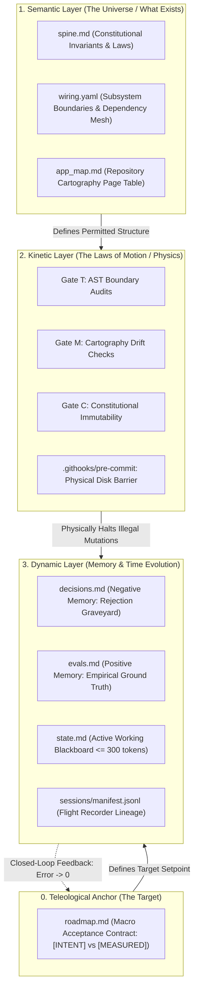

# Architecture & Cybernetic Ontology

In SDCS v1.4.1, the codebase is not modeled as an unconstrained filesystem. It operates as a **closed-loop deterministic cybernetic control system** organized across three physical layers governed by an external teleological anchor.

---

## The 4 Physical Layers

### Layer 0: Teleological Anchor (The Target)
* **Primary Artifact:** `roadmap.md` (Pillar 3: The North Star).
* **Role:** Establishes the macro mission. Separates human `[INTENT]` from empirical `[MEASURED]` reality.
* **Control Law:** The agent's sole task is driving the cybernetic error delta to zero:
  $$\Delta = [\text{INTENT}] - [\text{MEASURED}] \to 0$$
* **Invariant:** Strictly carries **no ephemeral task queue** (which belongs exclusively in `state.md`).

### Layer 1: Semantic Layer (What Exists)
* **Primary Artifacts:** `spine.md` (Pillar 1), `wiring.yaml` (Pillar 2), `app_map.md` (Pillar 5).
* **Role:** Defines entities, subsystem boundaries, interface contracts, and physical file locations.
* **Invariant:** The agent cannot invent modules, cross undeclared boundaries, or search outside declared cartography.

### Layer 2: Kinetic Layer (The Laws of Motion)
* **Primary Artifacts:** Gate T AST audits (`sdcs verify --topology`), Gate M cartography checks (`sdcs map --check`), Gate C contract immutability, and `.githooks/pre-commit`.
* **Role:** The physics engine of the repository. Every code mutation is treated as a kinetic state transition. Attempts to violate architectural contracts are physically halted on disk (`exit 1`).
* **Invariant:** Zero argumentative loops. Boundary violations are automatically formatted into Inverted ADRs (`## REJ-XXX`) and serialized to `decisions.md`.

### Layer 3: Dynamic Layer (Memory & Time Evolution)
* **Primary Artifacts:** `decisions.md` (Pillar 6), `evals.md` (Pillar 7), `state.md` (Pillar 4), `sessions/manifest.jsonl` (+1 Flight Recorder).
* **Role:** Manages cognitive state across shifts and compactions.
* **Invariant:** Working memory (`state.md`) is capped at $\le 300$ tokens. Historical session logs (`sessions/*.md`) are **never ingested on system boot**.

---

## The 4-Phase Autonomous Execution Engine

Every autonomous engineering turn progresses through a deterministic 4-phase cycle:

| Phase | Core Actions | Interacting Ontological Layer |
| :--- | :--- | :--- |
| **1. Orientation** | Hydrate state in rigid epistemological sequence (1: `spine` $\to$ 2: `roadmap` $\to$ 3: `app_map` $\to$ 4: `decisions` $\to$ 5: `evals` $\to$ 6: `state` $\to$ 7: `wiring`). | **Semantic** (`spine.md`, `app_map.md`) & **Dynamic** (`decisions.md`, `evals.md`, `state.md`). |
| **2. Planning** | Formulate atomic diffs against `state.md`. Consult `wiring.yaml` and page only necessary files via `sdcs map -s <subsystem>`. | **Semantic Layer** (`wiring.yaml`) to verify dependency graph validity. |
| **3. Execution** | Apply mutations and run empirical verification gates (`sdcs verify --topology`, `pytest`). | **Kinetic Layer** (AST audits & git hooks) and **Dynamic Layer** (`evals.md` benchmark scoring). |
| **4. Close-Out** | Prune `state.md` ($\le 300$ tokens), serialize any rejected attempts into `decisions.md`, and log shift handoff to `sessions/`. | **Dynamic Layer** (prepares clean state for subsequent turns). |
